# ss-alert

<!-- Auto Generated Below -->

## Overview

A message block that states what happened and, when it matters, interrupts to
say so.

The alert supplies the severity, the layout and the announcement; the caller
supplies the words, and any icon or actions, through slots. There is no
built-in icon set, following `ss-icon`, which is also a slot.

## Properties

| Property       | Attribute       | Description                                                                                                                                        | Type                                                     | Default     |
| -------------- | --------------- | -------------------------------------------------------------------------------------------------------------------------------------------------- | -------------------------------------------------------- | ----------- |
| `dismissLabel` | `dismiss-label` | Accessible label for the dismiss button.                                                                                                           | `string`                                                 | `'Dismiss'` |
| `dismissible`  | `dismissible`   | Renders a dismiss button.                                                                                                                          | `boolean`                                                | `false`     |
| `fullWidth`    | `full-width`    | Expands the alert to the full width of its container.                                                                                              | `boolean`                                                | `false`     |
| `heading`      | `heading`       | Title text, used when no title slot content is provided. Named `heading` because `title` is a global attribute and would render a browser tooltip. | `string`                                                 | `undefined` |
| `inlineStyles` | `inline-styles` | Inline CSS styles applied to the container.                                                                                                        | `string \| { [x: string]: string; }`                     | `undefined` |
| `size`         | `size`          | Size of the alert.                                                                                                                                 | `"2xl" \| "3xl" \| "lg" \| "md" \| "sm" \| "xl" \| "xs"` | `'md'`      |
| `variant`      | `variant`       | Severity, which sets both the colour and how insistently it is announced.                                                                          | `"error" \| "info" \| "success" \| "warning"`            | `'info'`    |
| `xId`          | `x-id`          | Id applied to the rendered container.                                                                                                              | `string`                                                 | `undefined` |

## Events

| Event       | Description                                                      | Type                               |
| ----------- | ---------------------------------------------------------------- | ---------------------------------- |
| `ssDismiss` | Emitted when the dismiss button is pressed; detail contains xId. | `CustomEvent<SsAlertDismissEvent>` |

## Slots

| Slot        | Description                                                                          |
| ----------- | ------------------------------------------------------------------------------------ |
|             | The message.                                                                         |
| `"actions"` | Buttons or links that resolve the alert.                                             |
| `"icon"`    | A leading icon, typically an `ss-icon`. Decorative: the message carries the meaning. |
| `"title"`   | Rich title content; overrides the `heading` prop.                                    |

## Dependencies

### Depends on

- [ss-typography](../../atoms/ss-typography)

### Graph

```mermaid
graph TD;
  ss-alert --> ss-typography
  style ss-alert fill:#000,stroke:#fff,stroke-width:4px
```

----------------------------------------------

*Built with love ❤️ by [Slice Soft](https://slicesoft.dev/) Team*
