# ss-breadcrumb-item

<!-- Auto Generated Below -->

## Overview

One step in a breadcrumb trail.

It exists because a separator cannot be drawn between slotted children: CSS
inside a shadow root cannot reach them, a scoped stylesheet does not apply to
them, and `::slotted` takes no pseudo-element. So each step draws its own,
and the trail tells it whether it is the last one — the same coordination the
rest of this library uses.

The last step is the page the reader is already on, so it is text rather than
a link, and carries `aria-current="page"`.

## Properties

| Property       | Attribute       | Description                                                                                       | Type                                 | Default     |
| -------------- | --------------- | ------------------------------------------------------------------------------------------------- | ------------------------------------ | ----------- |
| `href`         | `href`          | Where this step leads. Omitted, or on the last step, it renders as plain text.                    | `string`                             | `undefined` |
| `inlineStyles` | `inline-styles` | Inline CSS styles applied to the rendered element.                                                | `string \| { [x: string]: string; }` | `undefined` |
| `label`        | `label`         | Step text, used when no slot content is provided.                                                 | `string`                             | `undefined` |
| `last`         | `last`          | Whether this is the last step. Set by `ss-breadcrumb`; it decides the separator and aria-current. | `boolean`                            | `false`     |
| `separator`    | `separator`     | Separator drawn after this step. Set by `ss-breadcrumb`.                                          | `string`                             | `'/'`       |
| `size`         | `size`          | Size of the step. Set by `ss-breadcrumb`.                                                         | `"lg" \| "md" \| "sm"`               | `'md'`      |
| `xId`          | `x-id`          | Id applied to the rendered element.                                                               | `string`                             | `undefined` |

## Slots

| Slot | Description                                  |
| ---- | -------------------------------------------- |
|      | The step's text; overrides the `label` prop. |

## Dependencies

### Depends on

- [ss-link](../../atoms/ss-link)

### Graph

```mermaid
graph TD;
  ss-breadcrumb-item --> ss-link
  style ss-breadcrumb-item fill:#000,stroke:#fff,stroke-width:4px
```

----------------------------------------------

*Built with love ❤️ by [Slice Soft](https://slicesoft.dev/) Team*
