# ss-checkbox-group

<!-- Auto Generated Below -->

## Overview

Presents N `ss-checkbox` children as one `string[]` value and one change
event, with group semantics and an optional select-all master.

Membership is by value: a checkbox with no `value` cannot be a member and is
left uncoordinated, and two checkboxes sharing a value toggle together,
because the aggregate holds values rather than element identities.

## Properties

| Property         | Attribute          | Description                                                                                                                                                                                                                                                                                                                                                                                                                     | Type                                                     | Default      |
| ---------------- | ------------------ | ------------------------------------------------------------------------------------------------------------------------------------------------------------------------------------------------------------------------------------------------------------------------------------------------------------------------------------------------------------------------------------------------------------------------------- | -------------------------------------------------------- | ------------ |
| `disabled`       | `disabled`         | Disables every checkbox in the group, including the master.                                                                                                                                                                                                                                                                                                                                                                     | `boolean`                                                | `false`      |
| `errorText`      | `error-text`       | Error text, used when no error slot content is provided; shown only while invalid.                                                                                                                                                                                                                                                                                                                                              | `string`                                                 | `undefined`  |
| `helperText`     | `helper-text`      | Helper text, used when no helper slot content is provided.                                                                                                                                                                                                                                                                                                                                                                      | `string`                                                 | `undefined`  |
| `inlineStyles`   | `inline-styles`    | Inline CSS styles applied to the container.                                                                                                                                                                                                                                                                                                                                                                                     | `string \| { [x: string]: string; }`                     | `undefined`  |
| `invalid`        | `invalid`          | Marks the group invalid: reveals the error message and sets aria-invalid.                                                                                                                                                                                                                                                                                                                                                       | `boolean`                                                | `false`      |
| `label`          | `label`            | Group label, used when no label slot content is provided.                                                                                                                                                                                                                                                                                                                                                                       | `string`                                                 | `undefined`  |
| `name`           | `name`             | Native name shared by every checkbox, for form submission.                                                                                                                                                                                                                                                                                                                                                                      | `string`                                                 | `undefined`  |
| `orientation`    | `orientation`      | Stacks the choices, or lays them out in a row.                                                                                                                                                                                                                                                                                                                                                                                  | `"horizontal" \| "vertical"`                             | `'vertical'` |
| `required`       | `required`         | Requires at least one selection. HTML has no native "one of this set", so the group expresses it with the only construct that does: while nothing is selected the first checkbox is `required`, which makes the form invalid, and the moment anything is selected that requirement is lifted. Only one checkbox is ever announced as required, and checking any of them satisfies the group rather than that particular choice. | `boolean`                                                | `false`      |
| `selectAllLabel` | `select-all-label` | Label for an optional select-all checkbox. Supplying it renders the master; its checked and indeterminate state is derived from the selection and is not separately controllable.                                                                                                                                                                                                                                               | `string`                                                 | `undefined`  |
| `size`           | `size`             | Size shared by every checkbox, and by the group label.                                                                                                                                                                                                                                                                                                                                                                          | `"2xl" \| "3xl" \| "lg" \| "md" \| "sm" \| "xl" \| "xs"` | `'md'`       |
| `value`          | `value`            | The selected values. An array is not an attribute, so assign it as a property, following `ss-select.value`; no comma-separated form is accepted.                                                                                                                                                                                                                                                                                | `string[]`                                               | `[]`         |
| `xId`            | `x-id`             | Id of the container; also the seed for the generated message ids.                                                                                                                                                                                                                                                                                                                                                               | `string`                                                 | `undefined`  |

## Events

| Event       | Description                                                                   | Type                                      |
| ----------- | ----------------------------------------------------------------------------- | ----------------------------------------- |
| `ssChange`  | Emitted when the aggregate selection changes; detail carries the whole array. | `CustomEvent<SsCheckboxGroupChangeEvent>` |
| `ssInvalid` | Emitted when the group fails native validation.                               | `CustomEvent<SsCheckboxGroupChangeEvent>` |

## Slots

| Slot       | Description                                                                   |
| ---------- | ----------------------------------------------------------------------------- |
|            | The `ss-checkbox` children. Other elements are rendered but not coordinated.  |
| `"error"`  | Rich error content; overrides the `errorText` prop. Shown only while invalid. |
| `"helper"` | Rich helper content; overrides the `helperText` prop.                         |
| `"label"`  | Rich group label; overrides the `label` prop.                                 |

## Dependencies

### Depends on

- [ss-typography](../../atoms/ss-typography)
- [ss-checkbox](../../atoms/ss-checkbox)

### Graph

```mermaid
graph TD;
  ss-checkbox-group --> ss-typography
  ss-checkbox-group --> ss-checkbox
  style ss-checkbox-group fill:#000,stroke:#fff,stroke-width:4px
```

----------------------------------------------

*Built with love ❤️ by [Slice Soft](https://slicesoft.dev/) Team*
