# ss-field

<!-- Auto Generated Below -->

## Overview

Associates one form control with its label, helper text and error message,
generating the ids and coordinating the state that a consumer would otherwise
repeat on both the label and the control.

The control is supplied through the default slot and stays owned by the
caller: the field never touches its value, type, placeholder or appearance.
It sets only what association requires — the id the label points at, the
description reference, and the `required`/`disabled`/`invalid` state it was
given. State the field was not given is left as the caller set it on the
control; the field only clears what it applied itself.

## Properties

| Property       | Attribute       | Description                                                                              | Type                                                     | Default      |
| -------------- | --------------- | ---------------------------------------------------------------------------------------- | -------------------------------------------------------- | ------------ |
| `disabled`     | `disabled`      | Disables the field: attenuates the label and disables the control.                       | `boolean`                                                | `false`      |
| `errorText`    | `error-text`    | Error text, used when no error slot content is provided; shown only while invalid.       | `string`                                                 | `undefined`  |
| `helperText`   | `helper-text`   | Helper text, used when no helper slot content is provided.                               | `string`                                                 | `undefined`  |
| `inlineStyles` | `inline-styles` | Inline CSS styles applied to the container.                                              | `string \| { [x: string]: string; }`                     | `undefined`  |
| `invalid`      | `invalid`       | Marks the field invalid: reveals the error message and sets the control's invalid state. | `boolean`                                                | `false`      |
| `label`        | `label`         | Label text, used when no label slot content is provided.                                 | `string`                                                 | `undefined`  |
| `orientation`  | `orientation`   | Places the label above the control, or beside it.                                        | `"horizontal" \| "vertical"`                             | `'vertical'` |
| `required`     | `required`      | Marks the field required: adds the label marker and sets the control's required state.   | `boolean`                                                | `false`      |
| `size`         | `size`          | Size of the label; helper and error text follow one step below it.                       | `"2xl" \| "3xl" \| "lg" \| "md" \| "sm" \| "xl" \| "xs"` | `'md'`       |
| `xId`          | `x-id`          | Id of the container; also the seed for the generated control and message ids.            | `string`                                                 | `undefined`  |

## Slots

| Slot       | Description                                                                   |
| ---------- | ----------------------------------------------------------------------------- |
|            | The form control. If several are supplied, only the first is wired.           |
| `"error"`  | Rich error content; overrides the `errorText` prop. Shown only while invalid. |
| `"helper"` | Rich helper content; overrides the `helperText` prop.                         |
| `"label"`  | Rich label content; overrides the `label` prop.                               |

## Dependencies

### Depends on

- [ss-label](../../atoms/ss-label)
- [ss-typography](../../atoms/ss-typography)

### Graph

```mermaid
graph TD;
  ss-field --> ss-label
  ss-field --> ss-typography
  style ss-field fill:#000,stroke:#fff,stroke-width:4px
```

----------------------------------------------

*Built with love ❤️ by [Slice Soft](https://slicesoft.dev/) Team*
