# ss-pagination

<!-- Auto Generated Below -->

## Overview

Page navigation for a list that does not fit on one screen.

Unlike the other molecules this one is driven by props rather than slots: a
page range is data, not content, and the pages between the ends are computed
from `page` and `total`. Every rendered page is a real button, so keyboard
and screen-reader users move through the list the same way they move through
any other row of controls.

The component reports the page the reader asked for and updates its own
`page`; fetching the rows for it stays with the consumer.

## Properties

| Property             | Attribute             | Description                                                                                  | Type                                                     | Default           |
| -------------------- | --------------------- | -------------------------------------------------------------------------------------------- | -------------------------------------------------------- | ----------------- |
| `accessibilityLabel` | `accessibility-label` | Accessible name for the navigation region, so a page with two of them stays distinguishable. | `string`                                                 | `'Pagination'`    |
| `disabled`           | `disabled`            | Disables the whole control.                                                                  | `boolean`                                                | `false`           |
| `inlineStyles`       | `inline-styles`       | Inline CSS styles applied to the container.                                                  | `string \| { [x: string]: string; }`                     | `undefined`       |
| `nextLabel`          | `next-label`          | Label for the next-page control.                                                             | `string`                                                 | `'Next page'`     |
| `page`               | `page`                | The page currently shown, counting from one. Updated on interaction and reflected.           | `number`                                                 | `1`               |
| `previousLabel`      | `previous-label`      | Label for the previous-page control.                                                         | `string`                                                 | `'Previous page'` |
| `siblingCount`       | `sibling-count`       | How many pages to show either side of the current one before collapsing into a gap.          | `number`                                                 | `1`               |
| `size`               | `size`                | Size shared by every control.                                                                | `"2xl" \| "3xl" \| "lg" \| "md" \| "sm" \| "xl" \| "xs"` | `'md'`            |
| `total`              | `total`               | How many pages there are in total.                                                           | `number`                                                 | `1`               |
| `xId`                | `x-id`                | Id of the container; also included in event details.                                         | `string`                                                 | `undefined`       |

## Events

| Event      | Description                                                                   | Type                                   |
| ---------- | ----------------------------------------------------------------------------- | -------------------------------------- |
| `ssChange` | Emitted when a different page is requested; detail contains xId and the page. | `CustomEvent<SsPaginationChangeEvent>` |

## Dependencies

### Depends on

- [ss-button](../../atoms/ss-button)

### Graph

```mermaid
graph TD;
  ss-pagination --> ss-button
  style ss-pagination fill:#000,stroke:#fff,stroke-width:4px
```

----------------------------------------------

*Built with love ❤️ by [Slice Soft](https://slicesoft.dev/) Team*
