# ss-radio-group

<!-- Auto Generated Below -->

## Overview

Presents N `ss-radio` children as one selected value, one change event and
one set of group semantics, replacing the shared `name` a consumer would
otherwise repeat on every radio without ever gaining a group role, a group
label or an aggregate value.

The radios keep their own native input, styling and focus behaviour: arrow-key
navigation comes from the browser, because same-name radios in one tree
already do it. The group adds the name, the selected value, the accessible
grouping and the messages.

## Properties

| Property       | Attribute       | Description                                                                                                                                                                                                                                                                                                                                                                          | Type                                                     | Default      |
| -------------- | --------------- | ------------------------------------------------------------------------------------------------------------------------------------------------------------------------------------------------------------------------------------------------------------------------------------------------------------------------------------------------------------------------------------ | -------------------------------------------------------- | ------------ |
| `disabled`     | `disabled`      | Disables every radio in the group.                                                                                                                                                                                                                                                                                                                                                   | `boolean`                                                | `false`      |
| `errorText`    | `error-text`    | Error text, used when no error slot content is provided; shown only while invalid.                                                                                                                                                                                                                                                                                                   | `string`                                                 | `undefined`  |
| `helperText`   | `helper-text`   | Helper text, used when no helper slot content is provided.                                                                                                                                                                                                                                                                                                                           | `string`                                                 | `undefined`  |
| `inlineStyles` | `inline-styles` | Inline CSS styles applied to the container.                                                                                                                                                                                                                                                                                                                                          | `string \| { [x: string]: string; }`                     | `undefined`  |
| `invalid`      | `invalid`       | Marks the group invalid: reveals the error message and sets aria-invalid.                                                                                                                                                                                                                                                                                                            | `boolean`                                                | `false`      |
| `label`        | `label`         | Group label, used when no label slot content is provided.                                                                                                                                                                                                                                                                                                                            | `string`                                                 | `undefined`  |
| `name`         | `name`          | Native name shared by every radio in the group — the thing that makes the browser treat them as one group. Left unset, the group generates one, so a group always works; a name is only needed to submit under a chosen key.  It stays optional because a mandatory prop would make every custom element require it wherever a dynamic tag resolves against the generated JSX types. | `string`                                                 | `undefined`  |
| `orientation`  | `orientation`   | Stacks the choices, or lays them out in a row.                                                                                                                                                                                                                                                                                                                                       | `"horizontal" \| "vertical"`                             | `'vertical'` |
| `required`     | `required`      | Requires a selection: marks the group required for native validation.                                                                                                                                                                                                                                                                                                                | `boolean`                                                | `false`      |
| `size`         | `size`          | Size shared by every radio, and by the group label.                                                                                                                                                                                                                                                                                                                                  | `"2xl" \| "3xl" \| "lg" \| "md" \| "sm" \| "xl" \| "xs"` | `'md'`       |
| `value`        | `value`         | Value of the selected radio; updated on user interaction and reflected as an attribute.                                                                                                                                                                                                                                                                                              | `string`                                                 | `undefined`  |
| `xId`          | `x-id`          | Id of the container; also the seed for the generated message ids.                                                                                                                                                                                                                                                                                                                    | `string`                                                 | `undefined`  |

## Events

| Event       | Description                                                                   | Type                                    |
| ----------- | ----------------------------------------------------------------------------- | --------------------------------------- |
| `ssChange`  | Emitted when the selected value changes; detail contains xId, name and value. | `CustomEvent<SsRadioGroupChangeEvent>`  |
| `ssInvalid` | Emitted when the group fails native validation; detail may carry no value.    | `CustomEvent<SsRadioGroupInvalidEvent>` |

## Slots

| Slot       | Description                                                                   |
| ---------- | ----------------------------------------------------------------------------- |
|            | The `ss-radio` children. Other elements are rendered but not coordinated.     |
| `"error"`  | Rich error content; overrides the `errorText` prop. Shown only while invalid. |
| `"helper"` | Rich helper content; overrides the `helperText` prop.                         |
| `"label"`  | Rich group label; overrides the `label` prop.                                 |

## Dependencies

### Depends on

- [ss-typography](../../atoms/ss-typography)

### Graph

```mermaid
graph TD;
  ss-radio-group --> ss-typography
  style ss-radio-group fill:#000,stroke:#fff,stroke-width:4px
```

----------------------------------------------

*Built with love ❤️ by [Slice Soft](https://slicesoft.dev/) Team*
