# ss-modal

<!-- Auto Generated Below -->

## Overview

A dialog that takes over the page until it is answered.

It is the first consumer of the overlay utilities, and it is what proves
them: the focus trap and the dismissal behaviour are only really testable
through something that mounts them in a browser.

Rendered scoped rather than shadow so the trap can see the caller's content.
Focus order is a property of the composed tree, and a light-DOM query inside
a shadow root would find only what the dialog itself renders — a dialog full
of the caller's controls would look empty and trap focus on nothing.

## Properties

| Property             | Attribute             | Description                                                                 | Type                                                     | Default     |
| -------------------- | --------------------- | --------------------------------------------------------------------------- | -------------------------------------------------------- | ----------- |
| `accessibilityLabel` | `accessibility-label` | Accessible name, for a dialog with no visible heading.                      | `string`                                                 | `undefined` |
| `closeOnBackdrop`    | `close-on-backdrop`   | Pressing the backdrop closes the dialog.                                    | `boolean`                                                | `true`      |
| `closeOnEscape`      | `close-on-escape`     | Escape closes the dialog.                                                   | `boolean`                                                | `true`      |
| `dismissLabel`       | `dismiss-label`       | Accessible label for the close button.                                      | `string`                                                 | `'Close'`   |
| `dismissible`        | `dismissible`         | Renders a close button in the header.                                       | `boolean`                                                | `true`      |
| `heading`            | `heading`             | Heading text, used when no header slot content is provided.                 | `string`                                                 | `undefined` |
| `inlineStyles`       | `inline-styles`       | Inline CSS styles applied to the dialog element.                            | `string \| { [x: string]: string; }`                     | `undefined` |
| `open`               | `open`                | Whether the dialog is showing. Updated when it is dismissed, and reflected. | `boolean`                                                | `false`     |
| `size`               | `size`                | Width of the dialog.                                                        | `"2xl" \| "3xl" \| "lg" \| "md" \| "sm" \| "xl" \| "xs"` | `'md'`      |
| `xId`                | `x-id`                | Id applied to the dialog element.                                           | `string`                                                 | `undefined` |

## Events

| Event          | Description                                                                                   | Type                                            |
| -------------- | --------------------------------------------------------------------------------------------- | ----------------------------------------------- |
| `ssOpenChange` | Emitted when the dialog opens or closes through an interaction; detail contains xId and open. | `CustomEvent<{ xId?: string; open: boolean; }>` |

## Slots

| Slot       | Description                                        |
| ---------- | -------------------------------------------------- |
|            | The dialog's content.                              |
| `"footer"` | Actions, usually the ones that answer the dialog.  |
| `"header"` | Rich header content; overrides the `heading` prop. |

## Dependencies

### Depends on

- [ss-typography](../../atoms/ss-typography)

### Graph

```mermaid
graph TD;
  ss-modal --> ss-typography
  style ss-modal fill:#000,stroke:#fff,stroke-width:4px
```

----------------------------------------------

*Built with love ❤️ by [Slice Soft](https://slicesoft.dev/) Team*
