# ss-popover

<!-- Auto Generated Below -->

## Overview

Content anchored to a trigger, which the reader opens, uses and puts away
without losing the page.

Where `ss-modal` takes the page over, a popover sits beside it: no backdrop
and no focus trap. Focus goes into the panel when it opens, because that is
where the reader asked to go. Closing it with Escape sends focus back to the
trigger; closing it by pressing or tabbing somewhere else leaves focus where
the reader put it.

Rendered scoped for the same reason as the modal: finding the first control
to focus, and telling whether focus has left, both need to see the caller's
content, which a shadow root would hide.

## Properties

| Property             | Attribute             | Description                                                                                                   | Type                                     | Default     |
| -------------------- | --------------------- | ------------------------------------------------------------------------------------------------------------- | ---------------------------------------- | ----------- |
| `accessibilityLabel` | `accessibility-label` | Accessible name, for a panel with no visible heading.                                                         | `string`                                 | `undefined` |
| `align`              | `align`               | Alignment along the trigger's edge: start, center or end.                                                     | `"center" \| "end" \| "start"`           | `'center'`  |
| `closeOnEscape`      | `close-on-escape`     | Escape closes the panel.                                                                                      | `boolean`                                | `true`      |
| `closeOnOutside`     | `close-on-outside`    | Pressing outside the popover closes the panel.                                                                | `boolean`                                | `true`      |
| `disabled`           | `disabled`            | Disables the popover; it stays closed and the trigger does nothing.                                           | `boolean`                                | `false`     |
| `heading`            | `heading`             | Heading shown at the top of the panel, which also names it.                                                   | `string`                                 | `undefined` |
| `inlineStyles`       | `inline-styles`       | Inline CSS styles applied to the panel.                                                                       | `string \| { [x: string]: string; }`     | `undefined` |
| `open`               | `open`                | Whether the panel is showing. Updated on interaction, and reflected.                                          | `boolean`                                | `false`     |
| `placement`          | `placement`           | Side of the trigger to open on: top, right, bottom or left. Moves to the opposite side when there is no room. | `"bottom" \| "left" \| "right" \| "top"` | `'bottom'`  |
| `xId`                | `x-id`                | Id applied to the panel.                                                                                      | `string`                                 | `undefined` |

## Events

| Event          | Description                                                                                                               | Type                                            |
| -------------- | ------------------------------------------------------------------------------------------------------------------------- | ----------------------------------------------- |
| `ssOpenChange` | Emitted when an interaction opens or closes the panel, not when `open` is set from outside; detail contains xId and open. | `CustomEvent<{ xId?: string; open: boolean; }>` |

## Slots

| Slot        | Description                                                 |
| ----------- | ----------------------------------------------------------- |
|             | The popover's content.                                      |
| `"trigger"` | The control that opens the popover, usually an `ss-button`. |

## Dependencies

### Depends on

- [ss-typography](../../atoms/ss-typography)

### Graph

```mermaid
graph TD;
  ss-popover --> ss-typography
  style ss-popover fill:#000,stroke:#fff,stroke-width:4px
```

----------------------------------------------

*Built with love ❤️ by [Slice Soft](https://slicesoft.dev/) Team*
