# ss-toast

<!-- Auto Generated Below -->

## Overview

A short message that appears, says what happened, and goes away on its own.

The message is an `ss-alert`, so it brings the alert's severity, layout and
live-region role: a screen reader announces info and success politely and
interrupts for warning and error. What the toast adds is time. It closes
itself after `duration`, and the clock stops while the reader is hovering
over it, has focus inside it, or cannot see the page at all — a message that
disappears while someone is reading it, or while they are in another tab, was
never delivered (WCAG 2.2.1, Timing Adjustable).

Put toasts inside an `ss-toaster`, which pins them to a corner and stacks
them. A closed toast stays in the DOM and takes no room; remove it on
`ssOpenChange` when toasts are rendered from a list.

Scoped so the caller's content reaches the alert's own slots: it is moved
into the `ss-alert` element, where the alert slots it natively.

## Properties

| Property       | Attribute       | Description                                                                                                             | Type                                          | Default     |
| -------------- | --------------- | ----------------------------------------------------------------------------------------------------------------------- | --------------------------------------------- | ----------- |
| `dismissLabel` | `dismiss-label` | Accessible label for the dismiss button.                                                                                | `string`                                      | `'Dismiss'` |
| `dismissible`  | `dismissible`   | Renders a dismiss button.                                                                                               | `boolean`                                     | `true`      |
| `duration`     | `duration`      | Milliseconds before the toast closes itself. 0 keeps it until dismissed — use that for anything the reader must act on. | `number`                                      | `5000`      |
| `heading`      | `heading`       | Title text, used when no title slot content is provided.                                                                | `string`                                      | `undefined` |
| `inlineStyles` | `inline-styles` | Inline CSS styles applied to the toast's container.                                                                     | `string \| { [x: string]: string; }`          | `undefined` |
| `open`         | `open`          | Whether the toast is showing. Set to show it; updated when it closes, and reflected.                                    | `boolean`                                     | `false`     |
| `variant`      | `variant`       | Severity, which sets the colour and how insistently the message is announced.                                           | `"error" \| "info" \| "success" \| "warning"` | `'info'`    |
| `xId`          | `x-id`          | Id applied to the toast's container.                                                                                    | `string`                                      | `undefined` |

## Events

| Event          | Description                                                                                     | Type                                                                      |
| -------------- | ----------------------------------------------------------------------------------------------- | ------------------------------------------------------------------------- |
| `ssOpenChange` | Emitted when the toast closes itself or is dismissed; detail contains xId, open and the reason. | `CustomEvent<{ xId?: string; open: boolean; reason: ToastCloseReason; }>` |

## Slots

| Slot        | Description                                             |
| ----------- | ------------------------------------------------------- |
|             | The message.                                            |
| `"actions"` | Buttons or links that act on the message, such as Undo. |
| `"icon"`    | A leading icon, typically an `ss-icon`. Decorative.     |
| `"title"`   | Rich title content; overrides the `heading` prop.       |

## Dependencies

### Depends on

- [ss-alert](../../molecules/ss-alert)

### Graph

```mermaid
graph TD;
  ss-toast --> ss-alert
  ss-alert --> ss-typography
  style ss-toast fill:#000,stroke:#fff,stroke-width:4px
```

----------------------------------------------

*Built with love ❤️ by [Slice Soft](https://slicesoft.dev/) Team*
